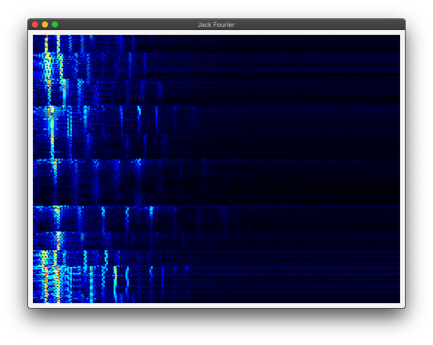

Jack Fourier
============

Spectrogram for jack using gtk in rust.

Extremely unpolished!

Building and Running
------------------

1. Setup your environment for rust compilation. (see, https://rustup.rs/)

2. Make sure that a [jack](https://jackaudio.org/) audio server is running.

3. Build / run by running `cargo run` in the project directory.

4. Use external [tools](https://jackaudio.org/applications/#control-applications) from the jack ecosystem to connect the audio input port to the audio output port of some other jack client.

5. Enjoy spectrograms.
